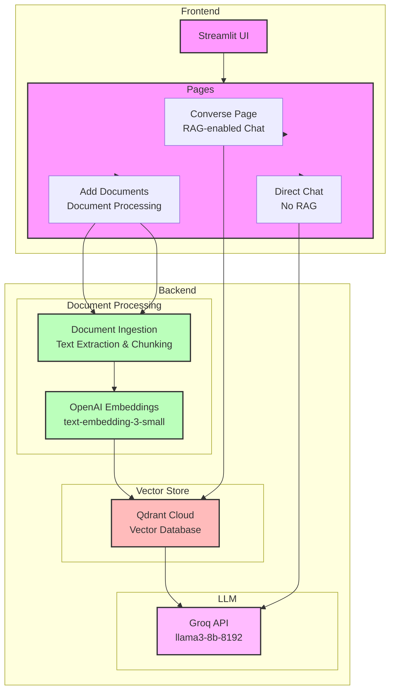

# FinKnow Architecture

## System Overview

## Technology Stack

### Frontend
- **Streamlit**: Web application framework for creating interactive UIs
- **Python**: Core programming language

### Backend
- **Document Processing**:
  - Custom text extraction and chunking
  - OpenAI Embeddings API (text-embedding-3-small)

### Vector Store
- **Qdrant Cloud**: Vector database for storing and retrieving document embeddings

### LLM
- **Groq API**: High-performance LLM inference
  - Model: llama3-8b-8192
  - Used for both RAG and direct chat

### Key Features
1. **RAG-enabled Chat**: Document-aware conversations using vector search
2. **Direct Chat**: Pure LLM interactions without document context
3. **Document Management**: Upload and process documents for knowledge base
4. **Vector Search**: Efficient semantic search over document chunks

### Data Flow
1. **Document Processing**:
   - Documents are uploaded through the UI
   - Text is extracted and chunked
   - Chunks are embedded using OpenAI's embedding model
   - Embeddings are stored in Qdrant

2. **RAG Chat**:
   - User question is embedded
   - Similar chunks are retrieved from Qdrant
   - Context and question are sent to Groq LLM
   - Response is generated and displayed

3. **Direct Chat**:
   - User message is sent directly to Groq LLM
   - Response is generated without document context 